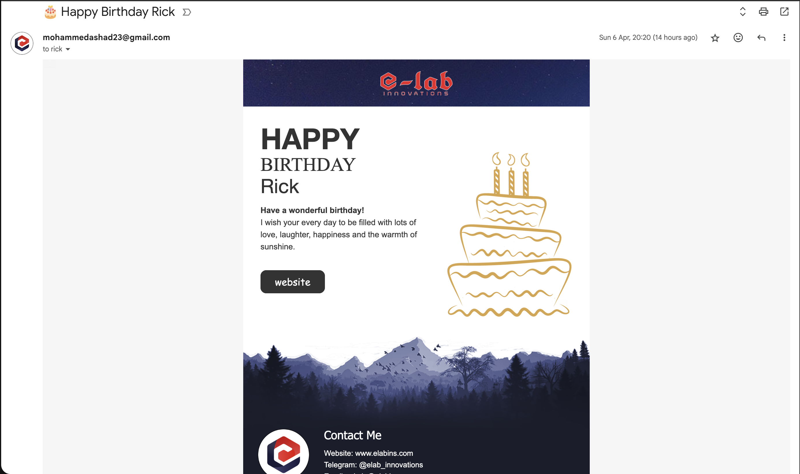
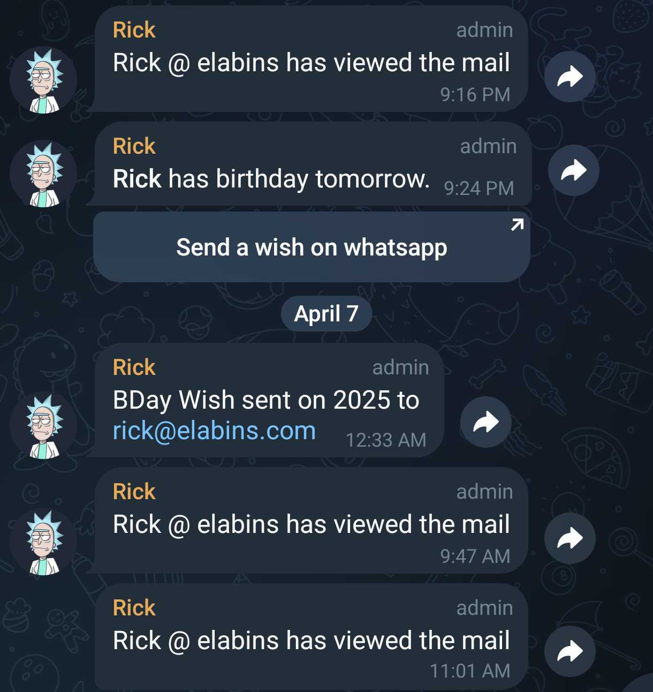

# 🎂 CakeMail

CakeMail is an automated birthday greeting system that has evolved from a simple Google Sheets-based emailer to a sophisticated contact management solution using Google's latest APIs.

## 📸 Preview

### Email Template



### Notifications



## 🚀 Project Evolution

### v1 (May 2019)

**The Beginning: Simple but Effective**

- Google Sheets as data source
- Google Docs as email template
- Basic email sending functionality
- Manual tracking through sheet updates

[Learn more about v1](v1/README.md)

### v2 (October 2020)

**Enhanced with Modern Features**

- Beautiful HTML email templates
- Email tracking capabilities
- Automated status updates
- Improved error handling

[Learn more about v2](v2/README.md)

### v3 (January 2023)

**Integration with Modern APIs**

- Google Contacts integration
- WhatsApp notifications (via whatabot.net)
- Multiple email templates
- Enhanced tracking system

[Learn more about v3](v3/README.md)

### v4 (April 2025)

**Enterprise-Ready Solution**

- Google People API for Contacts (replacing deprecated ContactsApp)
- Telegram Bot notifications
- Optional WhatsApp integration
- Secure credential management
- Modern, responsive email template

[Learn more about v4](v4/README.md)

## 🎯 Core Features

- **Automated Birthday Detection**: Checks for birthdays daily
- **Beautiful Email Templates**: Responsive, modern designs
- **Multi-Channel Notifications**: Email, Telegram, and WhatsApp
- **Tracking System**: Monitors email opens and interactions
- **Secure Configuration**: Uses Google's Properties Service
- **Detailed Logging**: Maintains history of all interactions

## 💡 Key Improvements Over Time

1. **Data Source Evolution**

   - v1: Google Sheets
   - v2: Enhanced Sheets with tracking
   - v3: Google Contacts (via ContactsApp)
   - v4: Google Contacts (via People API)

2. **Template System**

   - v1: Google Docs
   - v2: Single HTML template
   - v3: Multiple HTML templates
   - v4: Modern responsive template

3. **Notification Channels**

   - v1: Email only
   - v2: Email with tracking
   - v3: Email + WhatsApp
   - v4: Email + Telegram + Optional WhatsApp

4. **Security & Configuration**
   - v1: Hardcoded values
   - v2: Script properties
   - v3: Environment variables
   - v4: Properties Service with UI management

## 🛠️ Technology Stack

- Google Apps Script
- Google Workspace APIs (People API for Contacts)
- HTML/CSS for templates
- Telegram Bot API
- WhatsApp Business API
- Google Properties Service

## 📊 Timeline

```
2019 ──────────── 2020 ──────────── 2023 ──────────── 2025
   v1              v2                v3                v4
Basic Sheet    HTML Templates    ContactsApp      People API
& Doc Based    & Tracking       & WhatsApp       & Telegram
```

## 🔐 Security

- No hardcoded credentials
- Secure property storage
- OAuth2 authentication
- Limited permission scopes
- Audit logging

## 🤝 Contributing

Feel free to submit issues and enhancement requests!

## 💬 Credits

Created and maintained by [Mohammed Ashad](https://github.com/e-labinnovations)

## 📝 License

This project is licensed under the MIT License - see the [LICENSE](LICENSE) file for details.

---

Made with ❤️ by [e-lab innovations](https://elabins.com)
