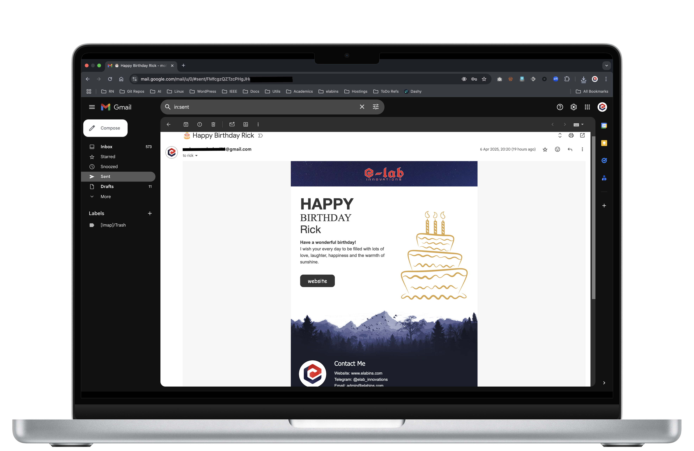
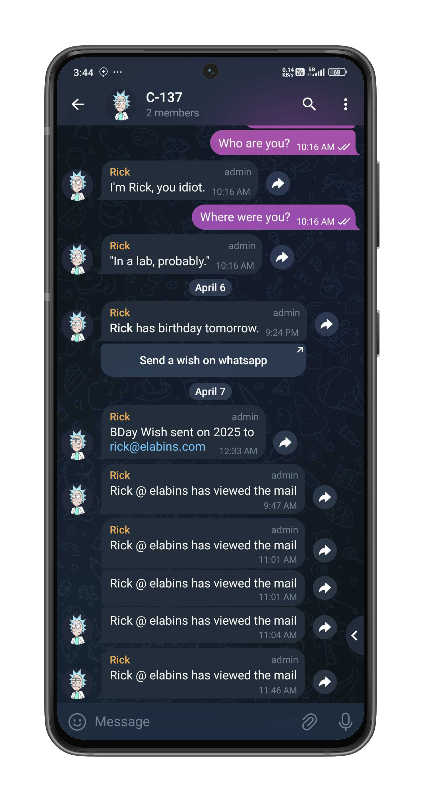
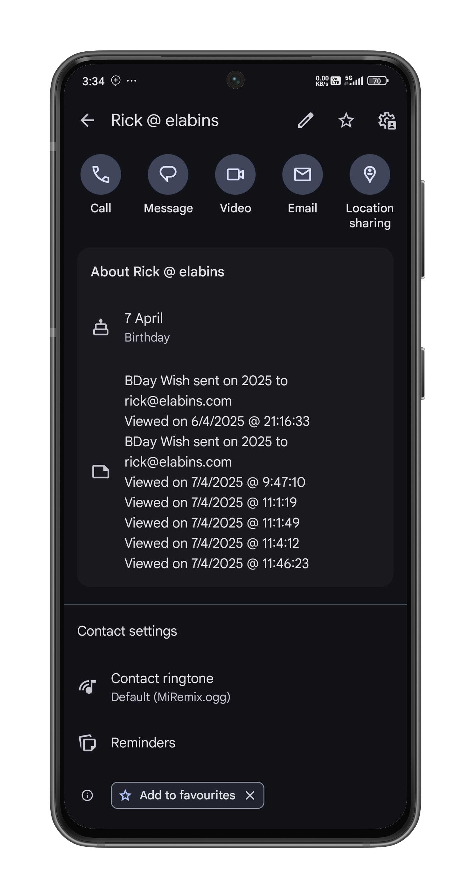
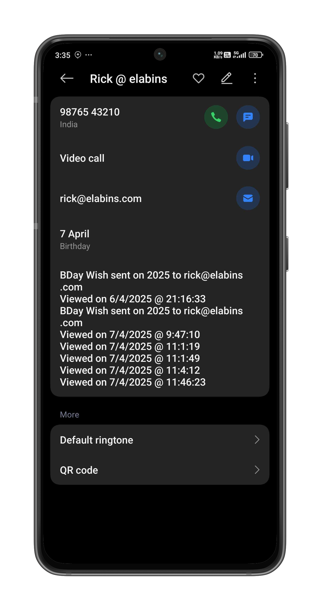

# The Evolution of CakeMail: From Google Sheets to People API

_How a simple birthday emailer evolved into a sophisticated contact management system_

Last Sunday, while looking for something interesting to work on, I remembered an old Google Apps Script project that needed some attention. The project, called CakeMail, had been showing some strikethrough throughout its methods - a clear sign that Google had deprecated the ContactsApp service I was using. This sparked an exciting journey to modernize the project using Google's People API.

## The Journey of CakeMail

CakeMail started as a simple idea in May 2019 - an automated system to send birthday wishes to contacts. Over the years, it has evolved through four major versions:

### v1 (2019): The Humble Beginning

- Google Sheets as data source
- Google Docs as email templates
- Basic email sending functionality

### v2 (2020): Enhanced Features

- Beautiful HTML email templates
- Email tracking capabilities
- Automated status updates

### v3 (2023): Modern Integration

- Google Contacts integration
- WhatsApp notifications
- Multiple email templates

### v4 (2025): Enterprise-Ready

- Google People API integration
- Telegram Bot notifications
- Secure credential management
- Modern, responsive email template

## The Migration Challenge

The recent migration to v4 was particularly interesting because it involved moving from the deprecated ContactsApp to Google's People API. This change brought several benefits:

1. **Modern API Support**: People API is Google's current recommended solution for contact management
2. **Enhanced Security**: Better OAuth2 authentication and permission scopes
3. **Improved Features**: More robust contact management capabilities
4. **Future-Proof**: No more deprecation warnings!

## Key Features of v4

The latest version includes several impressive features:

- Beautiful, responsive HTML email templates
- Multi-channel notifications (Email, Telegram, and optional WhatsApp)
- Email tracking system
- Secure configuration using Google's Properties Service
- Detailed logging of all interactions

## Technical Implementation

The migration to People API required several key changes:

1. **Authentication**: Setting up proper OAuth2 scopes
2. **Contact Management**: Rewriting contact retrieval and update methods
3. **Data Structure**: Adapting to the new API's data format
4. **Error Handling**: Implementing robust error handling for API calls

## The Result

The new version is not only more stable but also more feature-rich. The Telegram integration provides real-time notifications about:

- Birthday wishes sent
- Email opens
- Upcoming birthdays

## Lessons Learned

This project taught me several valuable lessons:

1. **Future-Proofing**: Always use the latest recommended APIs
2. **Modular Design**: Makes future migrations easier
3. **Security First**: Proper credential management is crucial
4. **User Experience**: Multiple notification channels improve engagement

## What's Next?

The project continues to evolve. Future plans include:

- AI-powered personalized messages
- Enhanced analytics dashboard
- Integration with more messaging platforms
- Improved template customization

## Conclusion

The migration to People API was a challenging but rewarding experience. It not only modernized the project but also improved its capabilities and security. CakeMail now stands as a robust, enterprise-ready solution for automated birthday greetings.

_What interesting projects have you modernized recently? Share your experiences in the comments!_

---

_Created by [Mohammed Ashad](https://github.com/e-labinnovations) | [e-lab innovations](https://elabins.com)_
